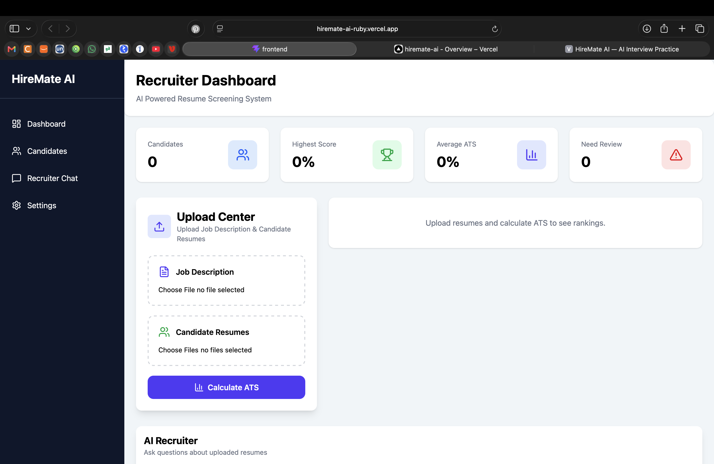
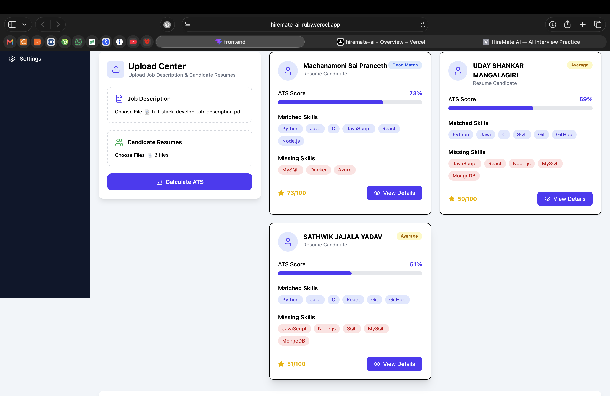
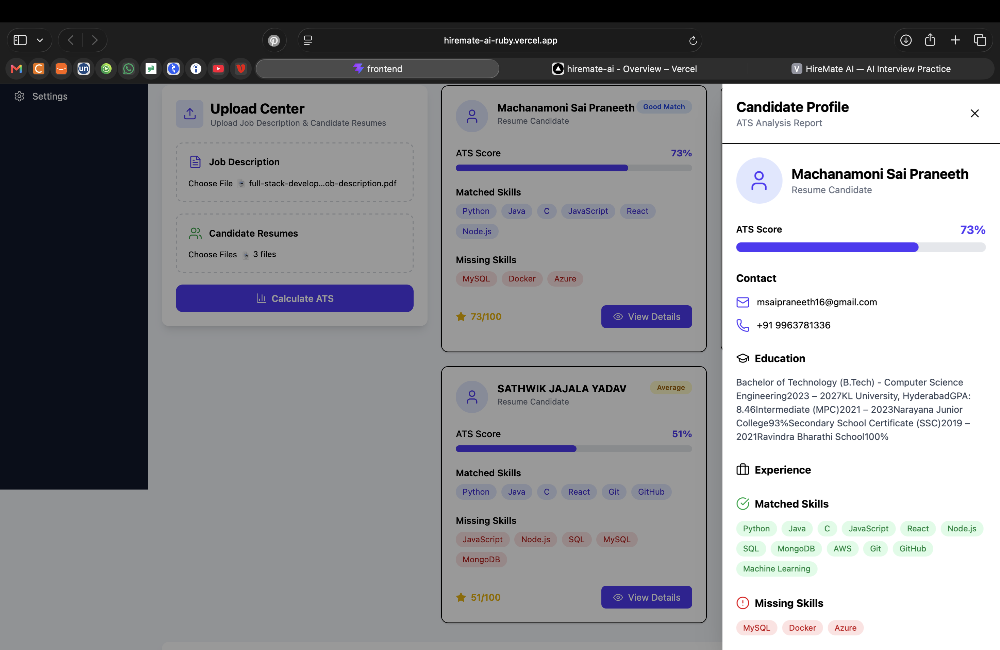
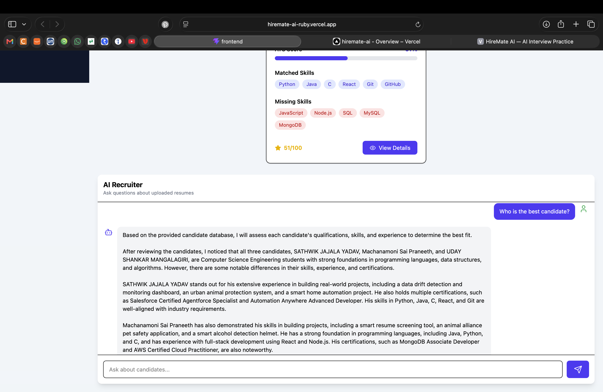

# HireMate AI 🚀

An AI-powered Applicant Tracking System (ATS) that helps recruiters automate resume screening, rank candidates based on job descriptions, and interact with resumes through an AI recruiter assistant.

---

## 📌 Features

- 📄 Upload Job Descriptions
- 📑 Upload Multiple Resumes (PDF/DOCX)
- 🤖 AI-powered Resume Parsing
- 📊 ATS Score Calculation
- 🏆 Candidate Ranking
- 👤 Detailed Candidate Profiles
- 💬 AI Recruiter Chat Assistant
- ⚡ Fast & Responsive Dashboard

---

## 🛠 Tech Stack

### Frontend
- React.js
- Vite
- Tailwind CSS
- Axios
- Lucide React

### Backend
- FastAPI
- Python
- Groq LLM
- PyMuPDF
- python-docx

---

## 🏗 System Architecture

```
Recruiter
      │
      ▼
 React Dashboard
      │
 REST API
      │
 FastAPI Backend
      │
 ├── Resume Parser
 ├── ATS Engine
 ├── Candidate Ranking
 └── AI Recruiter Chat
```

---

## 📷 Screenshots

> Add screenshots here after capturing them.

### Dashboard



### Candidate Ranking



### Candidate Details



### AI Recruiter Chat



---

## 📂 Project Structure

```
hiremate-ai
│
├── backend
│   ├── main.py
│   ├── ats_engine.py
│   ├── resume_parser.py
│   └── ...
│
├── frontend
│   ├── src
│   │   ├── components
│   │   ├── pages
│   │   └── services
│   └── ...
│
└── README.md
```

---

## ⚙ Installation

### Clone Repository

```bash
git clone https://github.com/saipraneeth525/hiremate-ai.git
```

### Backend

```bash
cd backend
python -m venv venv
source venv/bin/activate
pip install -r requirements.txt
uvicorn main:app --reload
```

### Frontend

```bash
cd frontend
npm install
npm run dev
```

---

## 🎯 Future Improvements

- Authentication
- Resume Comparison
- Email Integration
- Export Reports (PDF/CSV)
- Slack & Discord Integration
- Recruiter Analytics
- Advanced Skill Matching

---

## 👨‍💻 Author

**Sai Praneeth**

GitHub: https://github.com/saipraneeth525

---

⭐ If you like this project, consider giving it a star!